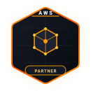
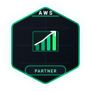
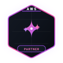
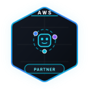
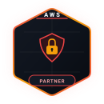
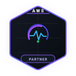
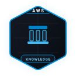

# ⚡ Sreeja R

### Cloud & DevOps Engineer · Backend Developer · Full Stack Developer

  &nbsp;
  &nbsp;
  

  Computer Science & Engineering student specializing in scalable backend architectures, cloud-native AWS infrastructure, and full-stack software development.

---

## 👩‍💻 About Me

- 🎓 **Education**: Computer Science & Engineering undergraduate at Vel Tech High Tech Dr. Rangarajan Dr. Sankunthala Engineering College (Chennai, India).
- ☁️ **Cloud Expertise**: **9 verified AWS credentials** covering Architecture, DevOps, Security, Cloud Economics, and Operations, with hands-on experience building and working with AWS cloud solutions.
- ⚙️ **Backend & Full Stack**: Designing robust, scalable applications and REST APIs using **Java, Python, Spring Boot, Hibernate, and MySQL**.
- 💼 **Professional Journey**: **AWS Cloud Intern at F13 Technologies** and **LLM Data Engineer Intern at IIITDM Kancheepuram**, working on cloud-based applications, AWS services, LLM data engineering, dataset preparation, code-correction workflows, and software development.
- 🚀 **Projects & Open Source**: Active contributor to **GirlScript Summer of Code (GSSoC)** and involved in developing real-world **AWS cloud, backend, AI/ML, and full-stack projects** with a focus on practical engineering and scalable solutions.
- 🤝 **Community & Growth**: Actively building expertise through **AWS Builder Center, open-source collaboration, technical projects, and continuous learning**, while exploring **cloud computing, AI/ML, LLM engineering, CI/CD automation, and clean software development practices**.

---

## 💼 Experience

### ☁️ AWS Cloud Intern · **F13 Technologies** *(2026 · Remote)*
- Engineered serverless cloud solutions and API integrations using **Lambda, S3, DynamoDB, API Gateway, and Cognito**.
- Implemented **Well-Architected Framework** best practices across IAM, VPC, RDS, CloudWatch, and cost-optimized deployments.

### 🤖 LLM Data Engineer Intern · **IIITDM Kancheepuram** *(2026 · Kancheepuram, India)*
- Curated and processed large-scale **C++ and Java code-correction datasets** (JSONL) for LLM fine-tuning and evaluation.
- Developed automated pipelines for buggy/fixed code pairing and subset optimization using **Google Colab & Antigravity IDE**.

### 🚀 Open Source Contributor · **GirlScript Summer of Code (GSSoC)** *(May 2026 – Present · Remote)*
- Actively contributing to open-source repositories through **modular feature development, bug fixes, and PR reviews**.
- Collaborating with global developer communities following structured Git branching and code-quality standards.

### 💻 Full Stack & Backend Developer · **Academic & Independent Projects** *(2024 – Present)*
- Architected scalable RESTful microservices using **Java, Spring Boot, Hibernate, MySQL, and Swagger/OpenAPI**.
- Built full-stack web and cloud applications integrating **Python, modern JavaScript, and AWS serverless services**.

---

## ☁️ AWS Accreditations & Badges

<table align="center" width="100%">
  <tr>
    <td align="center" width="33.33%" valign="top">
       
      <b>AWS Technical Accredited</b> 
      Trained Partner
    </td>
    <td align="center" width="33.33%" valign="top">
       
      <b>Cloud Economics Essentials</b> 
      Trained Partner
    </td>
    <td align="center" width="33.33%" valign="top">
       
      <b>Generative AI Technical</b> 
      Trained Partner
    </td>
  </tr>
  <tr>
    <td align="center" width="33.33%" valign="top">
       
      <b>Agentic AI Essentials</b> 
      Trained Partner
    </td>
    <td align="center" width="33.33%" valign="top">
       
      <b>Security Essentials</b> 
      Trained Partner
    </td>
    <td align="center" width="33.33%" valign="top">
       
      <b>Migration Essentials</b> 
      Trained Partner
    </td>
  </tr>
  <tr>
    <td align="center" width="33.33%" valign="top">
       
      <b>DevOps Essentials</b> 
      Trained Partner
    </td>
    <td align="center" width="33.33%" valign="top">
       
      <b>Cloud Operations Essentials</b> 
      Trained Partner
    </td>
    <td align="center" width="33.33%" valign="top">
       
      <b>AWS Migration Foundations</b> 
      Knowledge Trained
    </td>
  </tr>
</table>

---

## 🛠️ Technical Skills

| Domain | Technologies & Tools |
| :--- | :--- |
| **Languages** |       |
| **Backend & Cloud** |      |
| **Tools & Frameworks** |       |

---

## 🚀 Featured Projects

- [**TaskManagerAPI**](https://github.com/sreejar3011/TaskManagerAPI)  
  *Scalable RESTful API built with Spring Boot, MySQL, Spring Data JPA, Hibernate, and Swagger, featuring full CRUD, pagination, filtering, and sorting.*  
  `Java` · `Spring Boot` · `MySQL` · `Spring Data JPA` · `Hibernate` · `Swagger` · `Maven`

- [**Farmora-AI-Agriculture-App**](https://github.com/sreejar3011/Farmora-AI-Agriculture-App)  
  *AI-powered smart agriculture platform designed for crop monitoring, disease prediction, and data-driven farming insights.*  
  `Python` · `Predictive Insights` · `Smart Agriculture` · `HTML5` · `CSS3`

- [**Apurva-Sweets-Ecommerce-Frontend**](https://github.com/sreejar3011/Apurva-Sweets-Ecommerce-Frontend)  
  *Modern, responsive e-commerce web application featuring dynamic catalog flows and sleek user interaction designs.*  
  `JavaScript` · `Responsive UI/UX` · `E-Commerce` · `Frontend Engineering`

---

## 📊 GitHub Activity & Statistics

  <table border="0">
    <tr>
      <td align="center" valign="middle">
        
      </td>
      <td align="center" valign="middle">
        
      </td>
    </tr>
  </table>

---

## 📬 Connect With Me

  &nbsp;&nbsp;
  &nbsp;&nbsp;
  

  Designed & maintained by Sreeja R

